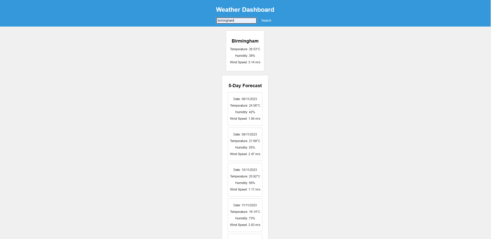

# weather-app

## user story
AS A traveler
I WANT to see the weather outlook for multiple cities
SO THAT I can plan a trip accordingly

## Key Features
Search for Weather: Enter a city name and click "Search" to get the current weather and 5-day forecast for that city.

Display Current Weather: View the city name, date, temperature, humidity, and wind speed for the current weather.

5-Day Forecast: Get a 5-day weather forecast that displays the date, temperature, humidity, and wind speed for each day.

Search History: Previous cities you've searched for are saved in the search history, and you can click on them to see their weather details again.

## Deployment
https://yasirjamah123.github.io/weather-app/

## Screenshots
